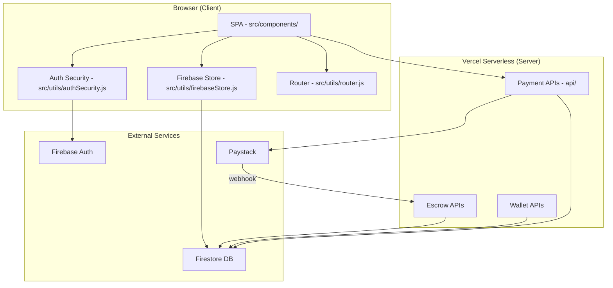
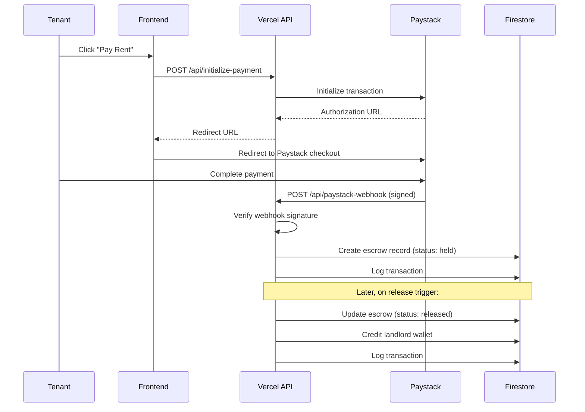

# Rentora — System Architecture

## Overview

Rentora is a single-page application (SPA) with a serverless backend. The frontend renders in the browser and communicates with Vercel serverless functions for secure operations. Firebase provides authentication and persistent storage.

---

## Architecture Diagram

## Data Flow: Payment → Escrow → Wallet

## Module Interactions

| Module | Reads From | Writes To | Depends On |
|--------|-----------|-----------|------------|
| Frontend Components | Firestore (via store) | Firestore (non-financial) | Auth, Router, Store |
| Payment APIs | Paystack, Firestore | Firestore (escrow, transactions) | Firebase Admin SDK |
| Escrow APIs | Firestore | Firestore (escrow, wallet, transactions) | Firebase Admin SDK |
| Wallet APIs | Firestore | Firestore (wallet, transactions) | Firebase Admin SDK |
| Auth Security | Firebase Auth | — | Firebase SDK |
| Firestore Rules | — | — | Firebase Auth (for RLS) |

## Security Boundaries

1. **Client ↔ Server**: Client NEVER handles financial confirmations. All payment verification happens server-side via Paystack webhooks.
2. **Server ↔ Database**: Server uses Firebase Admin SDK (bypasses client rules). Firestore security rules protect against direct client writes to financial collections.
3. **Server ↔ Paystack**: Webhook signature verification ensures only authentic Paystack events are processed.
